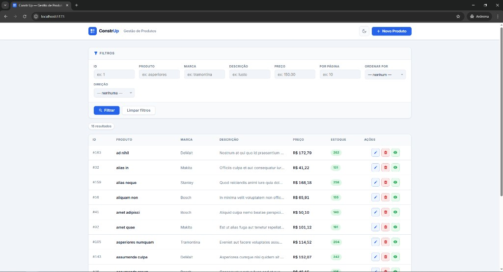
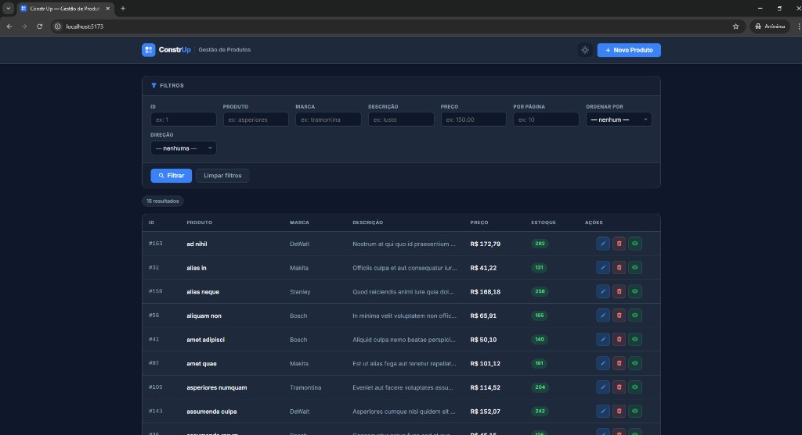

<p align="center">
  
</p>

# Constr Up — Gestão de Produtos

Interface Vue.js 3 para CRUD completo de produtos, consumindo a API REST da Construp.

---

## Temas

| Modo Claro | Modo Escuro |
|---|---|
|  |  |

---

## Requisitos

- [Node.js 20+](https://nodejs.org/) (para rodar localmente sem Docker)
- [Docker](https://www.docker.com/) + [Docker Compose](https://docs.docker.com/compose/) (para rodar em container)

---

## Configuração da API

Copie o arquivo de exemplo e ajuste a URL da API:

```bash
cp .env.example .env
```

Edite `.env`:

```env
VITE_API_BASE_URL=http://localhost:8080/api
```

Você pode trocar a URL para qualquer domínio onde a API esteja rodando.

---

## Rodando com Docker (recomendado)

```bash
# Subir o container em desenvolvimento
docker compose up --build

# Acessar no navegador
http://localhost:5173
```

Para encerrar:

```bash
docker compose down
```

---

## Rodando localmente (sem Docker)

```bash
# Instalar dependências
npm install

# Iniciar servidor de desenvolvimento
npm run dev
```

Acesse: [http://localhost:5173](http://localhost:5173)

---

## Build de produção

```bash
npm run build
```

Os arquivos estáticos serão gerados em `dist/`.

---

## Estrutura do projeto

```
construp-front/
├── public/
│   └── favicon.svg
├── src/
│   ├── assets/
│   │   └── main.css            # Design tokens e estilos globais
│   ├── components/
│   │   ├── ConfirmModal.vue    # Modal de confirmação de exclusão
│   │   ├── ProductFilters.vue  # Painel de filtros
│   │   ├── ProductForm.vue     # Modal de criação/edição
│   │   ├── ProductTable.vue    # Tabela de produtos
│   │   └── ToastNotification.vue # Feedback visual (toasts)
│   ├── services/
│   │   ├── api.js              # Instância do Axios configurada
│   │   └── productService.js   # Funções de acesso à API
│   ├── views/
│   │   └── ProductsView.vue    # Tela principal (orquestra tudo)
│   ├── App.vue
│   └── main.js
├── .dockerignore
├── .env                        # Variáveis de ambiente (não versionar)
├── .env.example                # Exemplo de variáveis de ambiente
├── docker-compose.yml
├── Dockerfile
├── index.html
├── package.json
└── vite.config.js
```

---

## Funcionalidades

| Funcionalidade        | Descrição                                                   |
|-----------------------|-------------------------------------------------------------|
| Listagem              | Tabela com ID, Produto, Marca, Descrição, Preço, Estoque    |
| Filtros               | Por ID, Produto, Marca, Descrição, Preço, Per Page, Ordenação |
| Criar produto         | Modal com validação de campos obrigatórios                  |
| Editar produto        | Mesmo modal, pré-preenchido com dados do produto            |
| Excluir produto       | Modal de confirmação antes de enviar DELETE                 |
| Ver detalhes          | Expansão inline da linha na tabela                          |
| Feedback visual       | Toasts de sucesso e erro, spinner de loading                |

---

## Variáveis de ambiente

| Variável            | Descrição                       | Padrão                      |
|---------------------|---------------------------------|-----------------------------|
| `VITE_API_BASE_URL` | URL base da API REST            | `http://localhost:8080/api` |

---

## API consumida

Base URL: `VITE_API_BASE_URL`

| Método | Endpoint             | Descrição              |
|--------|----------------------|------------------------|
| GET    | `/product`           | Listar produtos        |
| GET    | `/product/:id`       | Buscar produto por ID  |
| POST   | `/product`           | Criar produto          |
| PUT    | `/product/:id`       | Atualizar produto      |
| DELETE | `/product/:id`       | Excluir produto        |
